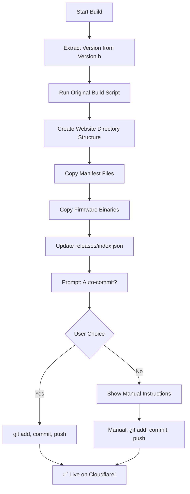

# 🚀 WeighMyBru² Automated Build & Release Workflow

This document outlines the improved build and release process that automates website deployment.

## 🎯 Quick Start (Recommended)

For the best experience, use the **PowerShell version** which includes interactive prompts and better error handling:

```powershell
.\build-and-release.ps1
```

This single command will:
1. ✅ Build firmware for both board variants
2. ✅ Extract version from `Version.h`
3. ✅ Copy files to website releases directory
4. ✅ Update release index
5. ✅ Optionally auto-commit and push to GitHub
6. ✅ Auto-deploy to Cloudflare

## 📋 Available Scripts

### 1. Enhanced Build & Release (PowerShell) - **RECOMMENDED**
```powershell
.\build-and-release.ps1 [options]
```

**Options:**
- `-Clean` - Clean build directories first
- `-Release` - Build release version
- `-Version "2.3.0"` - Set specific version (overrides Version.h)
- `-BuildNumber "123"` - Set custom build number

**Examples:**
```powershell
# Standard release build (auto-detects version from Version.h)
.\build-and-release.ps1 -Release

# Development build with clean
.\build-and-release.ps1 -Clean

# Custom version override
.\build-and-release.ps1 -Release -Version "2.3.0-beta"
```

### 2. Enhanced Build & Release (Batch)
```cmd
build-and-release.bat [options]
```

Same as PowerShell version but without interactive prompts.

### 3. Original Build Script
```cmd
build.bat [options]
```

The original build script - still works but doesn't handle website deployment.

## 🔄 Automated Workflow

When you run `build-and-release.ps1`, here's what happens:



## 📁 Generated File Structure

After running the enhanced build script:

```
build-output/
├── latest/
│   ├── manifest-supermini.json     # ESP32 Web Tools manifests
│   ├── manifest-xiao.json
│   ├── firmware-supermini.bin      # Firmware binaries
│   ├── firmware-xiao.bin
│   ├── bootloader.bin              # ESP32 system files
│   ├── partitions.bin
│   └── spiffs.bin

website/
└── releases/
    ├── index.json                  # Release index (for APIs)
    ├── latest/                     # Always points to newest
    │   ├── manifest-supermini.json
    │   ├── manifest-xiao.json
    │   └── *.bin
    └── v2.2.0/                     # Version-specific directory
        ├── manifest-supermini.json
        ├── manifest-xiao.json  
        └── *.bin
```

## 🎛️ Version Management

### Automatic Version Detection
The script automatically reads version from [include/Version.h](include/Version.h):

```cpp
#define WEIGHMYBRU_VERSION_MAJOR 2
#define WEIGHMYBRU_VERSION_MINOR 2  
#define WEIGHMYBRU_VERSION_PATCH 0
```

Results in version: `2.2.0`

### Manual Version Override
```powershell
.\build-and-release.ps1 -Version "2.3.0-beta"
```

## 🚀 Deployment to Cloudflare

### Auto-Deployment (Recommended)
When prompted "Would you like to automatically commit and push these changes? (y/N)":
- Type `y` to auto-commit and push
- Your Cloudflare site updates within 2-3 minutes

### Manual Deployment
```bash
git add website/releases/
git commit -m "Release v2.2.0 - Updated firmware manifests"
git push
```

## 🔧 Updating to New Version

### For Minor Updates (bug fixes, small features):
1. Update version in [include/Version.h](include/Version.h)
2. Run: `.\build-and-release.ps1 -Release`
3. Choose auto-commit when prompted
4. ✅ Done! Live in ~3 minutes

### For Major Updates:
1. Update version in [include/Version.h](include/Version.h)
2. Test locally first: `.\build-and-release.ps1 -Clean`
3. When ready: `.\build-and-release.ps1 -Release`
4. Choose auto-commit when prompted

## 🎯 Best Practices

### ✅ Do This:
- Always use `build-and-release.ps1` for releases
- Update `Version.h` before building
- Test locally before pushing
- Use descriptive commit messages

### ❌ Avoid This:  
- Don't manually copy files between directories
- Don't forget to update version in `Version.h`
- Don't mix development and release builds
- Don't skip testing new versions

## 🛠️ Troubleshooting

### "Build failed with exit code 1"
- Check PlatformIO is installed: `python -m platformio --version`
- Try clean build: `.\build-and-release.ps1 -Clean`

### "Git add failed"
- Check git is working: `git status`
- Verify you're in the right directory
- Check file permissions

### "Website still shows old version"
- Wait 3-5 minutes for Cloudflare deployment
- Check GitHub repo has the new files
- Clear browser cache

### "PowerShell execution policy error"
```powershell
Set-ExecutionPolicy -ExecutionPolicy RemoteSigned -Scope CurrentUser
```

## 📚 Additional Resources

- [ESP32 Web Tools Documentation](https://esphome.github.io/esp-web-tools/)
- [Cloudflare Pages Deployment](https://developers.cloudflare.com/pages/)
- [PlatformIO Build System](https://docs.platformio.org/en/latest/)

---

**Happy Building!** 🎉